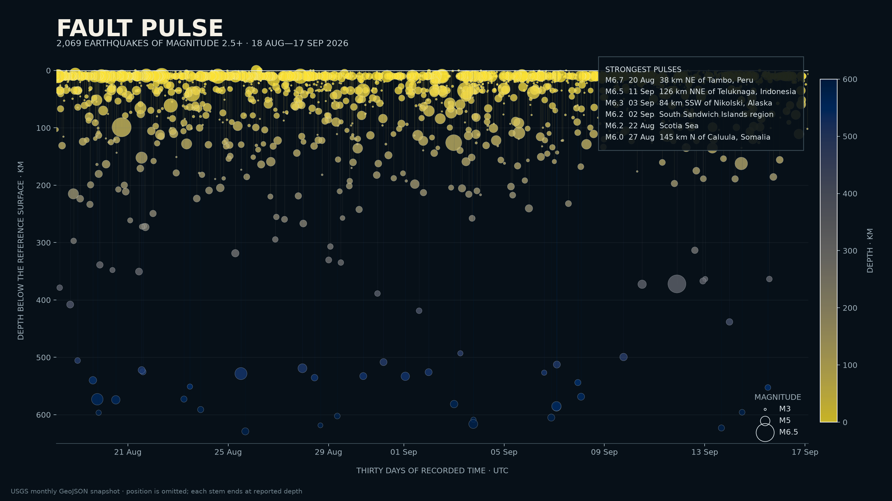

# Fault Pulse



## The phenomenon

Earthquakes make the planet's internal movement briefly measurable at the
surface. I am interested in the contrast between the calm appearance of the
ground and the continuous sequence of ruptures recorded underneath it. This
project turns thirty days of observations into a seismic score, with each event
treated as both a measurement and a mark left by the moving Earth.

## The source

The raw data comes from the
[United States Geological Survey earthquake feed](https://earthquake.usgs.gov/earthquakes/feed/v1.0/geojson.php).
The repository stores one unchanged GeoJSON snapshot generated on 17 September
2026. It contains 11,087 events recorded from 18 August to 17 September 2026.
Each feature represents one recorded event and includes its time, longitude,
latitude, depth in kilometres and magnitude.

## What the picture shows

The picture retains the 2,069 events of magnitude 2.5 or greater. Time runs from
left to right, every vertical stem ends at the event's reported depth, circle
size represents magnitude, and colour reinforces depth. The threshold reduces
the visual and regional bias produced by thousands of locally detected
microearthquakes, but does not remove differences in monitoring coverage.

The score shows a continuous field of mostly shallow events punctuated by a few
large or unusually deep shocks. It deliberately hides longitude and latitude so
that time and depth become the main structure. It also omits uncertainty, felt
reports and geological mechanism; consequently, it is not a map of earthquake
risk or a complete record of everything the Earth did.

## Run it

```
uv run fetch.py
uv run plot.py
```
